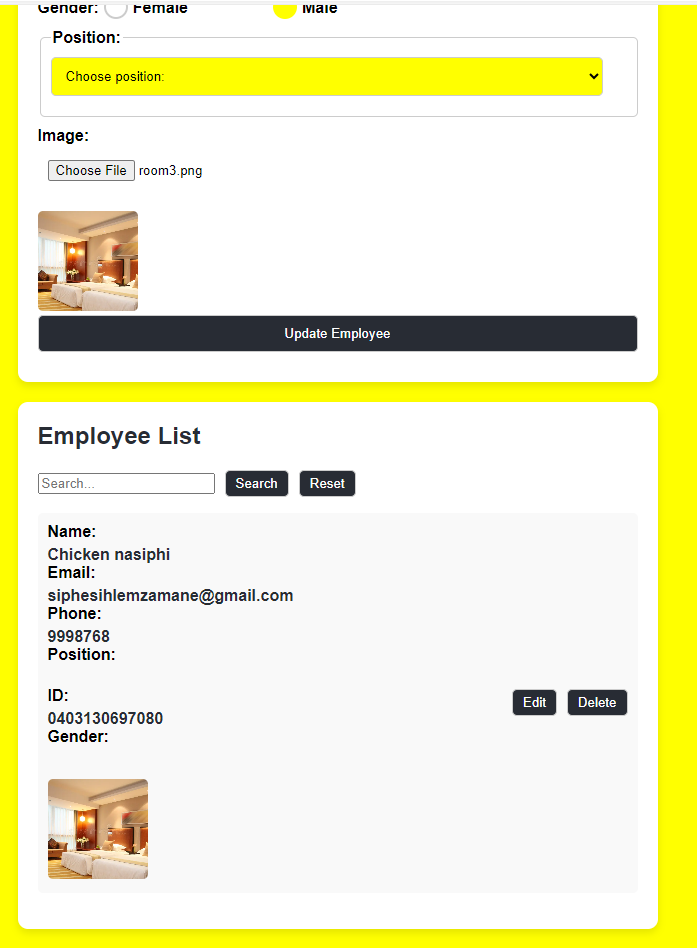
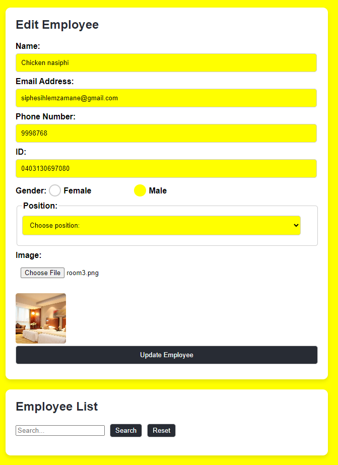
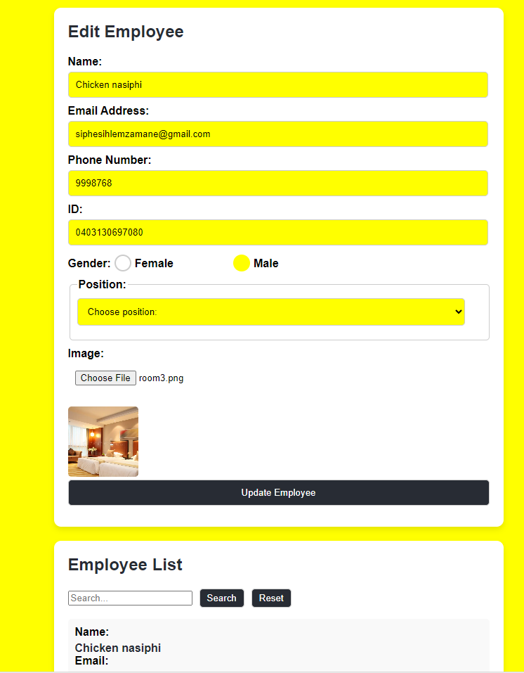

# Employee Registration Application

The **Employee Registration Application** allows users to manage employee records by performing CRUD (Create, Read, Update, Delete) operations. The app uses arrays to store data in local storage and a JSON Server to simulate a backend.

## Features

1. **Search Function:**
   - Users can search for employees by their ID.

   

2. **Add Function:**
   - Users can add a new employee by providing the following details:
     - Name
     - Email Address
     - Phone Number
     - Image
     - Position
     - ID

   

3. **Delete Function:**
   - Users can delete existing employees from the list.

   

4. **Update Function:**
   - Users can edit and update the details of existing employees.

   

5. **Local Storage:**
   - Employee data is stored in local storage as arrays for persistence.

6. **Backend Simulation:**
   - A JSON Server is used to simulate backend operations, making the application more realistic.

## Requirements

- **CRUD Operations:**
  - Implement all CRUD (Create, Read, Update, Delete) functionalities for employee management.

- **Local Storage:**
  - Store employee data in arrays within local storage for easy retrieval and persistence.

- **JSON Server:**
  - Use a JSON Server to simulate backend functionality.
  - Ensure the server is running locally at `http://localhost:3001/employees`.

## Getting Started

### Steps to run the application:

1. Clone  repository:
   ```bash
   git clone https://github.com/Siphe23/Employees-Form.git
   cd employee-registration-app
